# Agenda

## DSA and Big-O

- What are Data Structures?
- Linear Data Structures
- Non-Linear Data Structures
- Common Data Structure Operations
- Abstract Data Types
- What is an Algorithm?
- Analysis of an Algorithm
- Asymptotic Notations
- Big-O Notations
- Problem Solving Techniques

## What are Data Structures?

- A way of organizing and storing the data in memory.

- Helps to access and manipulate the data more effectively and efficiently, i.e. getting the desired result in minimum time.

## Data Structures

### Linear
- Arrays
- Stacks
- Queues
- Linked Lists

### Non-Linear
- Trees
- Graphs

## Linear Data Structures

- Arrange the elements in sequential or linear fashions.

- Each element is attached to its previous and next adjacent element.
  - Static Data Structure has a fixed memory size. The Array is an example.
  - Dynamic Data Structures size can change dynamically at runtime. They are efficient in memory as compared to the static data structure. Stack, Queue, and Linked list are examples of dynamic data structures.

- The elements are present at the same level which allows traversing in a single run.

- The time complexity increase as data size increase.

- Work well mainly in the development of application software.

## Non Linear Data Structures

- Arrange the elements in non-sequential order (a hierarchical order).

- The linear data structures are Trees, Graphs, Tables, Sets etc.

- The elements are present at various levels, so you can’t traverse them in a single run.

- Time complexity remains the same.

- Work well in image processing and Artificial Intelligence.

## DSA Advantages

- Language independent
- Improves logic building
- Improved problems solving approach
- Enables to solving real-world problems
- Helps in writing optimize code
- Improves adaptability to emerging tech stacks
- Helps to get jobs in top tech companies (MAANG)

## Common Data Structures Operations

- **Insertion:** Insert a new element to a data structure.
- **Deletion:** Delete an existing element from a data structure.
- **Searching:** Search an element inside a data structure.
- **Sorting:** Arranging the elements of a data structure in a specific order.
- **Traversal:** Visit each element inside a data structure exactly once.
- **Merging:** Combining two similar data structures together.

## Abstract Data Types (ADTs)

- Abstract data types are data structures that define the declaration of Data and Operations but not how these operations are implemented.

- The example of ADT are Array, Linked List, Stack, Queue, Binary Tree, Graphs etc.

- The implementation of ADT will be decided based on the programming language you will use.

## What is an Algorithm?

- A step-by-step procedure to solve a given problem.

- There are two main criteria to judge an algorithm:

- There are two main criteria to analyze an algorithm:
  - **Effectiveness:** How many steps it will take to give the desired result?
  - **Efficiency:** How much time and memory it will take to execute?

- An algorithm which takes the minimum steps to produce the desired result is considered the most effective.

- An algorithm which takes the minimum time and less space to execute is considered the most efficient.

## An Algorithm For Adding Two Numbers

- Step 1: Start

- Step 2: Declare variables num1, num2 and sum.

- Step 3: Read the values of num1 and num2.

- Step 4: Add the value of num1 and num2 and assign the result to sum.

  sum = num1 + num2

- Step 5: Display the value of sum.
## Algorithm Analysis

- Analysis of an algorithm helps to determine the time and space consumption to execute it.

- Helps to predict the behavior of an algorithm without implementing it on a specific computer.

## Worst Case
Take Maximum time to execute  
(Mostly Used)

## Best Case
Take Minimum time to execute  
(Very Rarely Used)

## Average Case
A prediction time to execute  
(Rarely Used)

Time = All random case time / Total cases

# Asymptotic Analysis

- Asymptotic analysis is a way of understanding how an algorithm behaves or performs with the change in the input size.

  - For example: In bubble sort, when the input array is in reverse order, the algorithm takes the maximum time (quadratic) to sort the elements i.e. the worst case.

  - But, when the input array is already sorted, the time taken by the algorithm is linear i.e. the best case.

  - When the input array is neither sorted nor in reverse order, then it takes average time i.e. average case.

# Asymptotic Notations

- **Big-O Notation (O-notation):** Represents the upper bound of the running time of an algorithm. It gives the worst-case complexity of an algorithm.

- **Omega notation (Ω-notation):** Represents the lower bound of the running time of an algorithm. It provides the best-case complexity of an algorithm.

- **Theta notation (Θ-notation):** Represents the upper and the lower bound of the running time of an algorithm. It is used for analyzing the average-case complexity of an algorithm.

# Big-O Notations

- O(1) – Constant

- O(logn) – Logarithmic

- O(n) – Linear

- O(nlogn) – Linearithmic

- O(n^c) – Polynomial Like Quadratic (n²), Cubic (n³) etc.

- O(c^n) – Exponential (2^n)

- O(n!) – Factorial.   

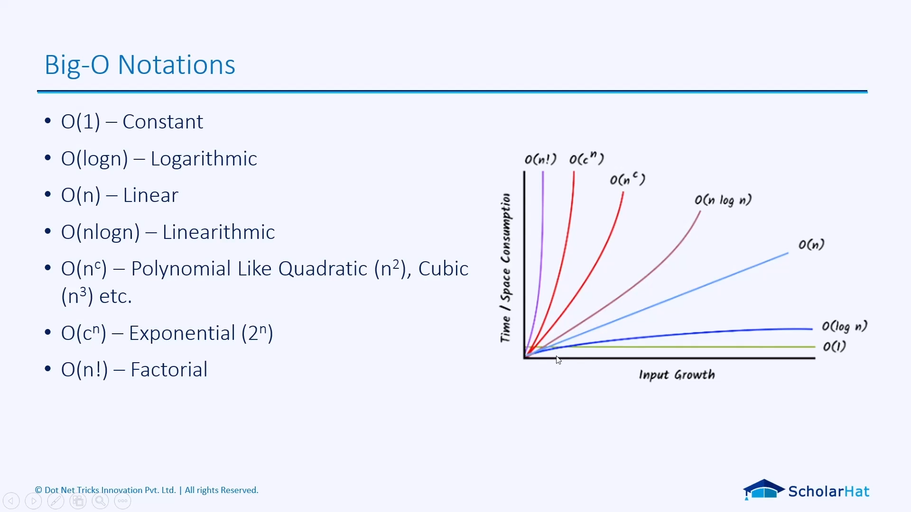

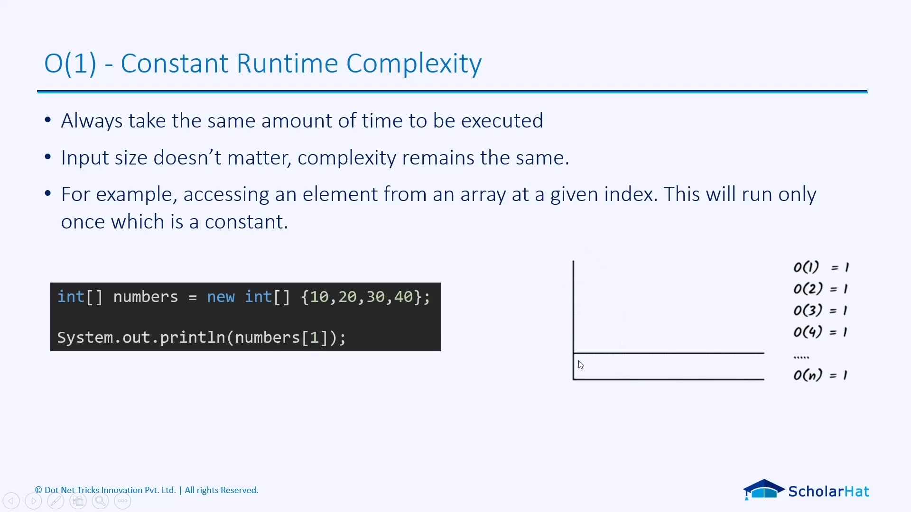
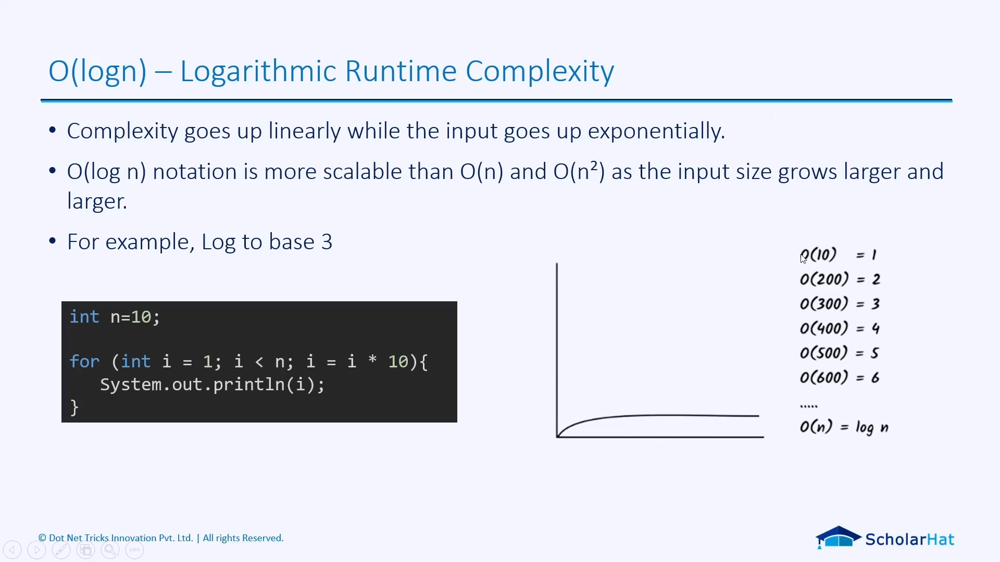
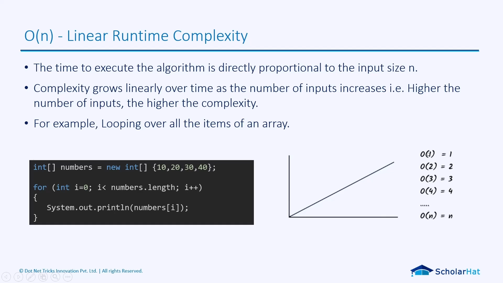
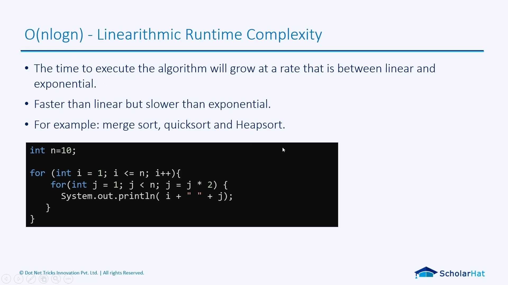
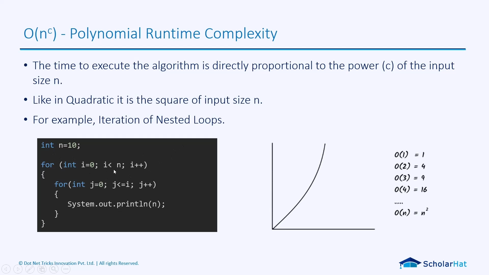
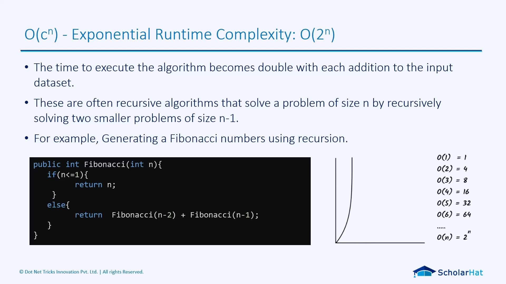
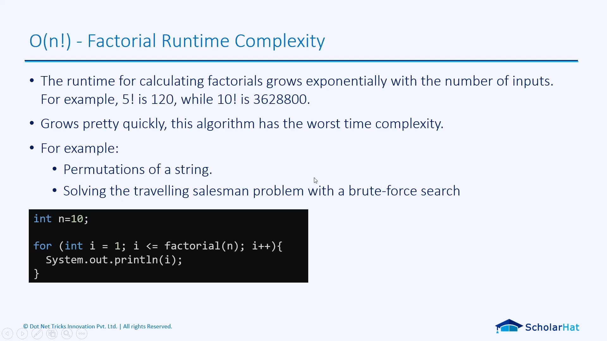
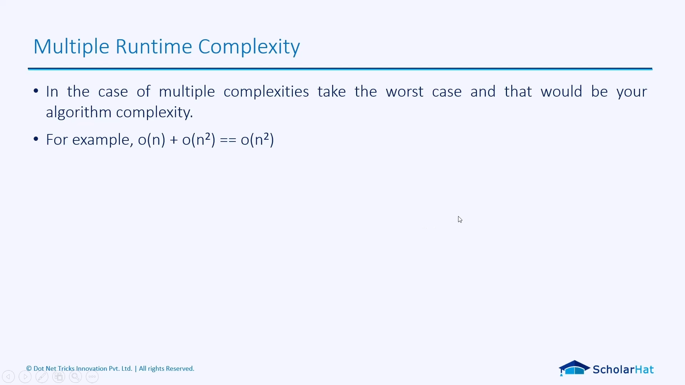
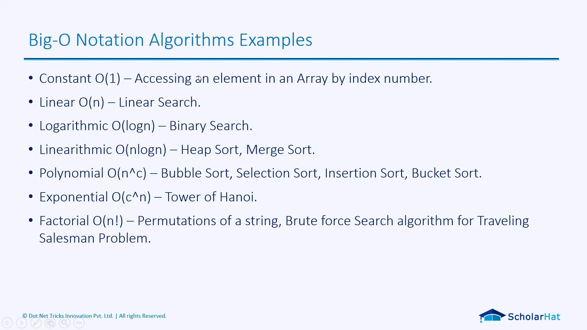
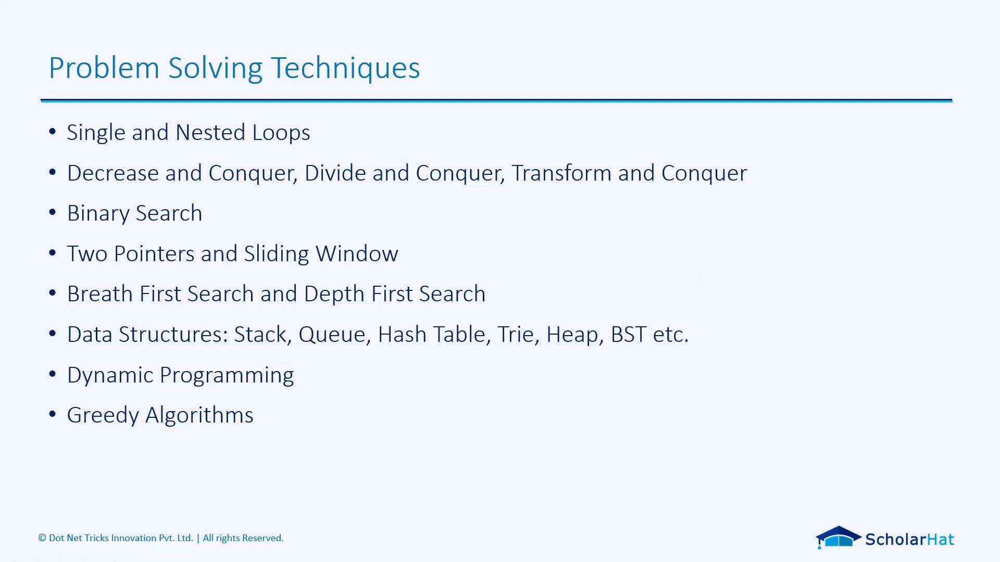